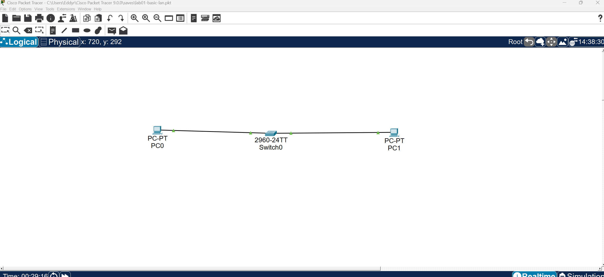

# ccna-homelab
Hands-on networking labs built while studying for the Cisco CCNA. Includes Packet Tracer files, configurations, and troubleshooting notes.
## Topology

---

## IP Configuration

### PC0

### PC1

---

## Connectivity Test

Successful ping between PC0 and PC1.

---

## Example Failed Ping (Troubleshooting)

Example of a failed ping when the configuration is incorrect.

